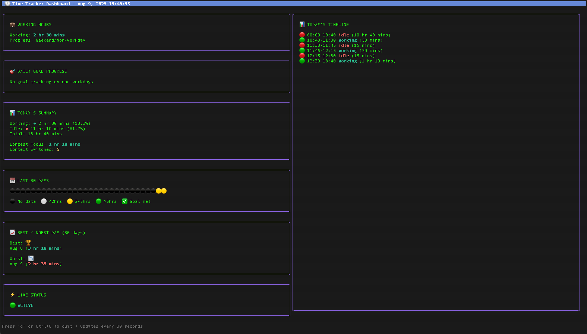
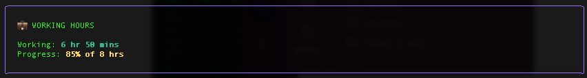
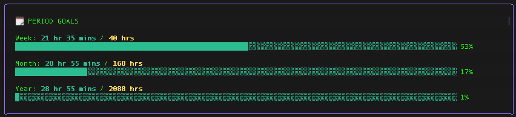
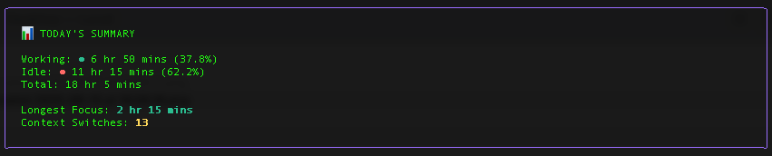
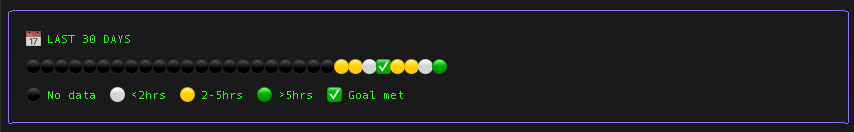
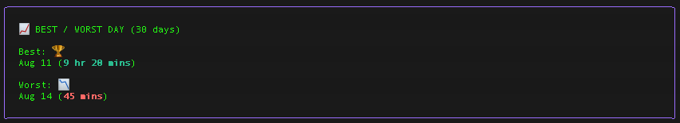
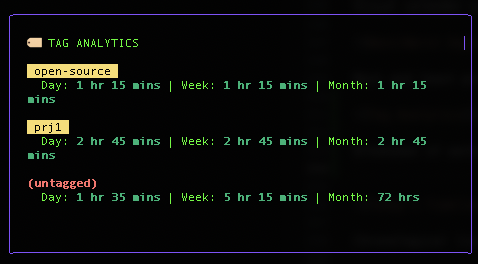
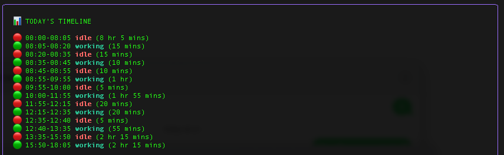
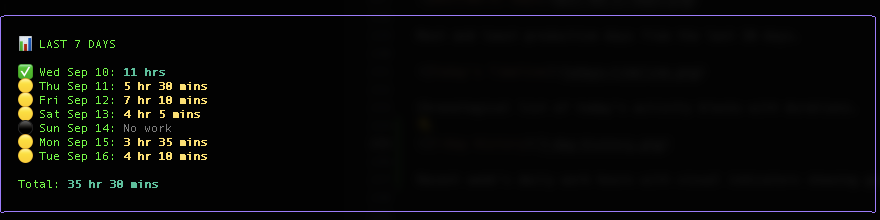

# 🕐 TimeTrack CLI





A lightweight, privacy-focused time tracking tool for macOS that automatically monitors your productivity without any manual intervention. Track your work hours, analyze patterns, and stay motivated with beautiful visualizations.

## ✨ Features

- **🔒 Privacy First**: All data stays on your machine, no cloud sync required
- **⚡ Automatic Tracking**: Uses macOS system APIs to detect activity vs idle time
- **📊 Beautiful Dashboard**: Real-time terminal dashboard with visual progress tracking
- **🏷️ Time Tagging**: Tag time blocks for project/activity categorization with autocomplete
- **📊 Tag Analytics**: View hours breakdown by tags across day/week/month periods
- **📈 Comprehensive Reports**: Daily, weekly, monthly, and yearly insights
- **🎯 Goal Setting**: Configurable daily work hour targets
- **📅 Smart Scheduling**: Flexible workday configuration (Mon-Fri, custom days, etc.)
- **🚀 Startup Integration**: Optional launch-at-login for seamless tracking
- **💾 Efficient Storage**: Smart data compression for long-term usage

## 🚀 Quick Start

### Installation


### Homebrew (Recommended)
```bash
# Add tap and install
brew tap rezmoss/timetrackcli
brew install timetrackcli

# Start tracking
timetrackcli
```

### Direct Download
Download the latest release for your system:

- **[Universal Binary (Intel + Apple Silicon)](https://github.com/rezmoss/timetrackcli/releases/latest/download/timetrackcli-darwin-universal.tar.gz)** - Recommended
- **[Intel Macs (x64)](https://github.com/rezmoss/timetrackcli/releases/latest/download/timetrackcli-darwin-amd64.tar.gz)**
- **[Apple Silicon (ARM64)](https://github.com/rezmoss/timetrackcli/releases/latest/download/timetrackcli-darwin-arm64.tar.gz)**

```bash
# Extract and install (example with universal binary)
curl -L https://github.com/rezmoss/timetrackcli/releases/latest/download/timetrackcli-darwin-universal.tar.gz | tar xz
chmod +x timetrackcli-darwin-universal
sudo mv timetrackcli-darwin-universal /usr/local/bin/timetrackcli

# Start tracking
timetrackcli
```

### Build from Source

```bash
# Clone the repository
git clone https://github.com/yourusername/timetrackcli.git
cd timetrackcli

# Build the binary
go build -o timetrackcli timetrackcli.go

# Start tracking (will prompt for startup integration)
./timetrackcli
```

### First Run Setup

On first run, the app will ask if you want to add it to macOS login items for automatic startup:

```
[startup] This app is not set to launch at login. Add it now? [y/N]: y
[startup] Added to login (LaunchAgents): /Users/username/Library/LaunchAgents/com.timetrackcli.autostart.plist
```

**macOS Permissions**: You'll need to grant Accessibility permissions in System Preferences > Security & Privacy > Privacy > Accessibility for activity detection to work.

## 📖 Usage

### Basic Tracking

```bash
# Start tracking (runs in background)
./timetrackcli
```

The tracker samples your activity every 30 seconds and categorizes time into 5-minute bins as either "working" or "idle" based on keyboard/mouse activity.

### Interactive Dashboard

```bash
# Launch real-time dashboard
./timetrackcli --dashboard
```

The dashboard displays:
- **Working Hours**: Current session time and daily goal progress
- **7-Day History**: Week-at-a-glance view with daily work hours and goal achievement indicators
- **Daily Goal Progress**: Visual progress bar with percentage
- **Today's Summary**: Work/idle breakdown with focus statistics
- **Tag Analytics**: Hours breakdown by project/activity tags for day/week/month
- **30-Day Overview**: Visual calendar showing productivity patterns
- **Best/Worst Days**: Highest and lowest productivity days
- **Period Goals**: Week, month, and year progress tracking with visual indicators
- **Live Timeline**: Real-time activity blocks with durations
- **Live Status**: Current activity state (Active/Idle with duration)

### Reports

```bash
# Today's detailed report
./timetrackcli --report

# Weekly report (current week, Monday-Sunday)
./timetrackcli --report --range=week

# Monthly report (current month)
./timetrackcli --report --range=month

# Yearly report (current year, monthly breakdown)
./timetrackcli --report --range=year
```

**Sample Report Output:**
```
Date : Aug 8, 2025 , Friday
--------------------------------------------------
Time Range      | Duration     | Description
--------------------------------------------------
00:00-09:50     | 9 hr 50 mins | idle
09:50-10:20     | 30 mins      | working
10:20-10:25     | 5 mins       | idle
10:25-11:25     | 1 hr         | working
--------------------------------------------------
Total working today : 1 hr 30 mins
Daily goal progress: 18% of 8 hrs
```

## ⚙️ Configuration

### Daily Goal Setting

```bash
# Set 8-hour daily goal (default)
./timetrackcli --config dailygoal=08:00

# Set 7.5-hour goal
./timetrackcli --config dailygoal=07:30

# Set 6-hour goal
./timetrackcli --config dailygoal=06:00
```

### Working Days Configuration

```bash
# Monday to Friday (default)
./timetrackcli --config workdays=Mon-Fri

# Wednesday to Friday only
./timetrackcli --config workdays=Wed-Fri

# Specific days (Monday, Tuesday, Wednesday, Friday)
./timetrackcli --config workdays=Mon,Tue,Wed,Fri

# Weekend work schedule
./timetrackcli --config workdays=Sat,Sun

# Every day
./timetrackcli --config workdays=Mon-Sun
```

### Custom Data File Location

```bash
# Use custom file location
./timetrackcli --file=/path/to/custom/timetrack.json

# All commands support custom file location
./timetrackcli --file=~/Documents/work-time.json --dashboard
```


### Tag Management

Tag your work sessions to categorize time by project, activity type, or client:
```bash
# Launch dashboard and tag time blocks interactively
./timetrackcli --dashboard

# Navigate timeline with ↑↓ arrow keys
# Press Enter on any time block to add/edit tags
# Use Tab to see tag suggestions from previous entries
# Tags are saved automatically and appear in analytics
```

## 📊 Dashboard Features

### Visual Elements
- **🟢 Green Circles**: High productivity days (5+ hours)
- **🟡 Yellow Circles**: Medium productivity (2-5 hours)
- **⚪ White Circles**: Low productivity (<2 hours)
- **⚫ Gray Circles**: No activity/data
- **✅ Checkmarks**: Days where daily goal was achieved

### Key Metrics
- **Longest Focus Session**: Longest continuous working period today
- **Context Switch Count**: Number of times you switched between working/idle
- **Goal Progress**: Percentage of daily goal completed (workdays only)
- **30-Day Trends**: Visual productivity patterns over time
- **Tag Analytics**: Time distribution across projects/activities for multiple periods


### Period Goals Tracking
- **Week Progress**: Current week's work hours vs weekly goal with progress bar
- **Month Progress**: Current month's work hours vs monthly goal with progress bar  
- **Year Progress**: Current year's work hours vs yearly goal with progress bar
- **Smart Goal Calculation**: Automatically calculates period goals based on workdays and daily goal settings
- **Visual Progress**: Color-coded progress bars showing completion percentage for each period


### Dashboard Components

#### Working Hours & Goals


Shows current day's working time and progress toward daily goal.


Visual progress bar with percentage completion of daily work goal.



Week, month, and year progress tracking with visual progress bars.

#### Activity Analysis


Work/idle breakdown with focus metrics and context switches.



Visual calendar of last 30 days with productivity indicators.



Most and least productive days from the last 30 days.



Breakdown of work hours by project/activity tags showing day, week, and month totals for each tag.




Chronological list of today's activity blocks with durations.



Recent week's daily work hours with visual indicators showing goal achievement and productivity patterns.


## 🛠️ Advanced Usage

### Background Operation

The tool is designed to run continuously in the background. When started, it:
1. Samples activity every 30 seconds
2. Groups time into 5-minute bins
3. Automatically saves data
4. Optimizes storage by compacting old data into ranges

### Data Storage

- **Location**: `./timetrackcli.json` (or custom path via `--file`)
- **Format**: JSON with automatic compression
- **Privacy**: All data stays local, no network requests
- **Backup**: Consider backing up your JSON file periodically
- **Tags**: Stored as part of time ranges with searchable tag list


### Performance

- **CPU Usage**: Minimal (samples every 30 seconds)
- **Memory**: Low footprint (~5-10MB)
- **Storage**: Efficient compression keeps files small long-term
- **Battery**: Negligible impact on battery life

## 🔧 Troubleshooting

### Permissions Issues
If tracking isn't working:
1. Open System Preferences > Security & Privacy > Privacy
2. Click "Accessibility" 
3. Add your terminal app and/or the `timetrackcli` binary
4. Restart the tracking

### Data Recovery
```bash
# Check if data file exists and is valid
cat timetrackcli.json | jq .

# Backup your data
cp timetrackcli.json backup-$(date +%Y%m%d).json
```

### Common Issues

**"HIDIdleTime not found" error**: Ensure you have Accessibility permissions granted.

**No data showing**: Check that the tool has been running and permissions are correct.

**Large file sizes**: The tool automatically compacts data, but very old installations might benefit from manually backing up and starting fresh.

## 🏗️ Development

### Building from Source

```bash
# Install dependencies
go mod tidy

# Build for macOS
go build -o timetrackcli timetrackcli.go

# Install globally (optional)
go install
```

### Dependencies
- `github.com/charmbracelet/bubbletea` - Terminal UI framework
- `github.com/charmbracelet/lipgloss` - Style definitions

### Architecture
- **Bin-based tracking**: 5-minute intervals for granular data
- **Range compression**: Automatic optimization for long-term storage
- **Real-time dashboard**: 30-second refresh rate
- **Cross-session persistence**: Robust JSON storage

## 📄 License

MIT License - feel free to fork, modify, and use for personal or commercial projects.

## 🤝 Contributing

Contributions welcome! Please:
1. Fork the repository
2. Create a feature branch
3. Add tests for new functionality
4. Submit a pull request

## 🔮 Roadmap

- [ ] Window-based activity categorization
- [ ] Export to CSV/PDF reports
- [ ] Integration with calendar apps
- [ ] Team/project time allocation
- [ ] Web dashboard companion
- [ ] Linux/Windows support

## 💡 Tips

- **Consistent tracking**: Add to login items for automatic startup
- **Regular reviews**: Check weekly/monthly reports to identify patterns
- **Goal adjustment**: Adjust daily goals based on actual productivity patterns
- **Backup data**: Periodically backup your `timetrackcli.json` file
- **Custom schedules**: Configure workdays to match your actual schedule
- **Project tracking**: Use tag analytics to see time distribution across projectsRetry

---

*Built with ❤️ for developers who value privacy and simplicity.*